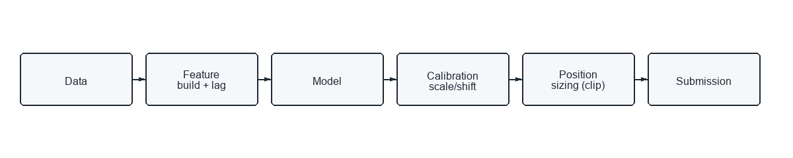

# sp500-market-prediction-tabpfn (Hull TabPFN)

基于多因子金融时间序列数据，预测 `forward_returns`，评估指标为调整后的 Sharpe（Adjusted/Modified Sharpe）。

本仓库是对 `hull-tabpfn` 工作目录的整理版本，保留了核心代码、Notebook 与可视化产物，便于别人一键拉取并复现实验。

**比赛**：Hull Tactical Market Prediction（Kaggle）

**复现步骤（环境/命令/输出）**
1. 环境：Windows / PowerShell；Python 3.10/3.11；CUDA 版 Torch；数据放在 `data\hull-tactical-market-prediction`（`train.csv`/`test.csv`）。
2. 命令：
```powershell
$pythonExe = "C:\Users\xuanz\AppData\Local\Programs\Python\Python311\python.exe"
.\run_all.ps1 -PythonExe $pythonExe -DataRoot data\hull-tactical-market-prediction -OutDir outputs -SkipEda
```
3. 输出：`outputs/submission.csv`、`outputs/submission.parquet`、`outputs/artifacts/tabpfn_model/metadata.json`、`outputs/logs/run_all_*.log`、`outputs/logs/pipeline_*.log`。

**三段式读者导读**

**30 秒**
- 这个项目做什么：用 TabPFN 对 `forward_returns` 做回归预测，并输出可提交的仓位预测。
- 指标是什么：Kaggle 使用调整后 Sharpe（带波动与收益惩罚项）的评分。
- 方案是什么：TabPFN 预测 + 校准（scale/shift）+ 仓位截断映射，直接对齐评分函数。

**3 分钟**
- 数据切分（可审计）：`load_data` 以 `test.csv` 最小 `date_id` 为分界，剔除 `train_df["date_id"] >= test_start`。
- 训练：`src/run_tabpfn_pipeline.py` 训练 TabPFN（可下采样），保存模型与特征列表。
- 推理与仓位映射：`apply_calibration` 进行 scale/shift 并 clip 到 `[min_position, max_position]`，写入 submission。
- 如何复现：按“复现步骤”或 `run_all.ps1` 一键跑通。

**30 分钟**
- 关键设计选择：lag 特征、前视列过滤、以 Adjusted Sharpe 作为校准目标、使用最后窗口校准、强制仓位上下限。
- 风险点：时间泄漏、校准窗口过短导致不稳定、GPU 资源不足导致训练过慢、分布漂移。
- Ablation：关闭校准、改变校准窗口、去掉 lag 特征、不同下采样规模、仅 CPU 运行对比。

**Pipeline**
如果你的 Markdown 渲染器不支持 Mermaid，请直接使用 PNG/SVG：



[SVG 版本](docs/pipeline.svg)

<details>
<summary>Mermaid 源码（可选）</summary>

```mermaid
flowchart LR
  Data[Raw data (train/test)] --> Feature[Feature build + lagged cols]
  Feature --> Model[TabPFN regressor]
  Model --> Calib[Calibration (scale/shift by adjusted Sharpe)]
  Calib --> Position[Position sizing (clip)]
  Position --> Submission[submission.csv]
```

</details>

**可审计：时间切分/OOF**
- 结论清单与验证脚本：`docs/01_oof_split_audit.md`
- 训练集去泄漏：`src/run_tabpfn_pipeline.py` 的 `load_data` 使用 `test_start = int(test_df["date_id"].min())`，保留 `train_df["date_id"] < test_start`。
- 可验证输出：脚本打印 `Train rows ... Overlap dates ...`，可用 `overlap_dates` 检查是否存在重叠日期。
- 校准窗口：`calibrate_predictions` 对训练集末尾 `calibration_window` 天（默认 180）优化 scale/shift。
- Rolling OOF 未进入 `run_all.ps1`，需要请在 Notebook 中扩展时间滑窗验证。

**可审计：评分实现与对齐**
- 评分函数入口：`src/run_tabpfn_pipeline.py` 中 `adjusted_sharpe`。
- 关键公式摘要：`strategy_returns = rf*(1-position) + position*forward_returns`；`excess_vol_penalty = 1 + max(0, strat_vol/market_vol - 1.2)`；`return_penalty = 1 + (return_gap**2)/100`；`score = sharpe / (excess_vol_penalty * return_penalty)`。
- 校准入口：`calibrate_predictions` 使用 `Powell` 在 `scale in [0.8,1.2]` 与 `shift in [-0.5,0.5]` 上最大化 adjusted_sharpe。
- 详细伪代码：`docs/scoring.md`。

**可审计：推理与提交映射**
- 模型输出：`TabPFNService.predict_raw` 生成对 `forward_returns` 的连续预测。
- 映射：`apply_calibration` 执行 `pred*scale + shift` 并 clip 到 `[min_position, max_position]`（默认 0 到 2）。
- 提交字段：`run_pipeline` 自动生成 `submission.csv`，列为 `row_id/id` 与 `prediction`。
- 可核对：`outputs/artifacts/tabpfn_model/metadata.json` 记录 scale/shift 与 raw/adjusted Sharpe。

## 目录
- `src/`：可执行脚本（训练、推理、EDA）
- `notebooks/`：核心 Notebook（EDA、提交、成功版本）
- `assets/eda/`：EDA 可视化图片
- `kaggle-summary.md`：比赛总结与工作展示

## 快速开始
1. 安装依赖
```bash
pip install -r requirements.txt
```

2. 获取数据（不随仓库提供）
- 推荐：使用 Kaggle API 下载到 `data/hull-tactical-market-prediction/`
- 或者手动下载后放到同目录

3. 运行最小基线
```bash
python src/run_tabpfn_min.py --data-root data/hull-tactical-market-prediction --out-dir outputs
```

4. 运行完整流程（含校准）
```bash
python src/run_tabpfn_pipeline.py --data-root data/hull-tactical-market-prediction --out-dir outputs
```

5. 运行 EDA
```bash
python src/eda_tabpfn.py --data-root data/hull-tactical-market-prediction --output-dir outputs/eda
python src/eda_make_plots.py
```

## 一键运行
Windows / PowerShell 可使用：
```powershell
.\run_all.ps1 -DataRoot data\hull-tactical-market-prediction -OutDir outputs -InstallDeps
```
详细操作说明见：`docs/run_all.md`

可选参数：
- `-SkipEda`：跳过 EDA
- `-CkptPath`：指定本地 TabPFN 权重
- `-Offline`：强制离线模式
- `-MaxTrainingRows`：训练下采样行数（加速）
- `-DownloadData`：用 Kaggle CLI 自动下载数据
- `-KaggleCompetition`：比赛标识（默认 `hull-tactical-market-prediction`）
- `-SkipValidation`：跳过提交文件校验
- `-PythonExe`：指定 Python 解释器路径（建议指向 GPU 可用的 Python）
- `-RequireGPU`：是否强制 GPU（默认 `true`，检测到 CPU 运行会强退）
- `-GpuMinUtil` / `-GpuMinMemoryMB`：GPU 监测阈值
- `-GpuCheckDelaySec` / `-GpuCheckWindowSec` / `-GpuCheckIntervalSec`：GPU 监测窗口参数
- `-LogPath`：主日志路径（默认写入 `outputs/logs/`）
- `-DisableLog`：关闭自动日志保存

日志默认保存到 `OutDir\logs\`，包括 `run_all_时间戳.log` 与 `pipeline_时间戳.log` / `pipeline_时间戳.err.log`。如需允许 CPU 运行：使用 `-RequireGPU:$false`。

## 本地评分示例
说明：本地评分基于 **训练集末尾窗口** 的校准评估（Adjusted Sharpe），不是 Kaggle 线上分数。

```powershell
$pythonExe = "C:\Users\xuanz\AppData\Local\Programs\Python\Python311\python.exe"
& $pythonExe scripts\score_local.py `
  --data-root d:\OneDrive\Project\kaggle-hull\data\hull-tactical-market-prediction `
  --out-dir outputs_local_score `
  --max-training-rows 5000

type outputs_local_score\artifacts\tabpfn_model\metadata.json
```

重点字段：
- `raw_sharpe`
- `adjusted_sharpe`

## 重要说明
- 数据集与大文件（模型、缓存、离线 wheel）已加入 `.gitignore`。
- TabPFN 默认会从 HuggingFace 拉取权重，离线环境可传入：
```bash
python src/run_tabpfn_pipeline.py --ckpt-path /path/to/tabpfn-v2-regressor.ckpt --offline
```
- 如需修改 Notebook 训练行数限制，可使用：
```bash
python scripts/apply_runtime_cap.py --notebook notebooks/kaggle-submit-tabtfn.ipynb --max-training-rows 20000
```

## 复现路径约定
脚本会优先读取以下路径（按顺序）：
1. `--data-root` 参数
2. 环境变量 `HULL_DATA_ROOT`
3. `/kaggle/input/hull-tactical-market-prediction`
4. `data/hull-tactical-market-prediction`
5. `input/hull-tactical-market-prediction`

## 推荐阅读
- `kaggle-summary.md`
- `docs/tech_overview.md`
- `docs/scoring.md`
- `docs/run_all.md`
- `docs/run_all_report.md`
- `notebooks/hull-tabtfn-only-success.ipynb`


